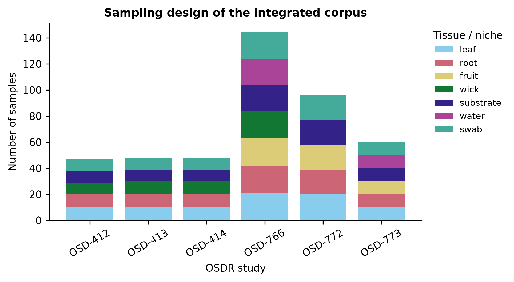
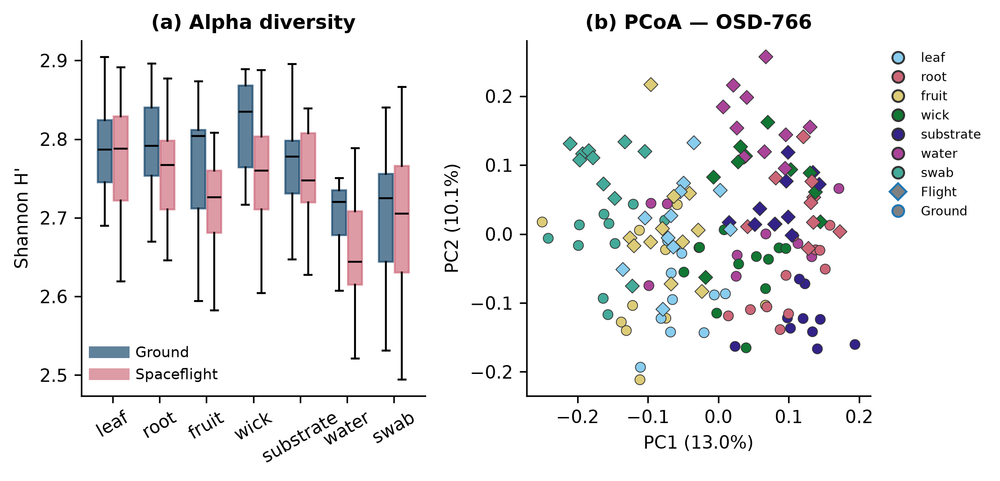
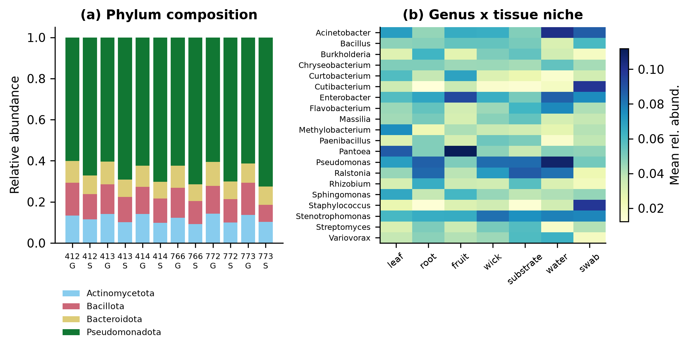
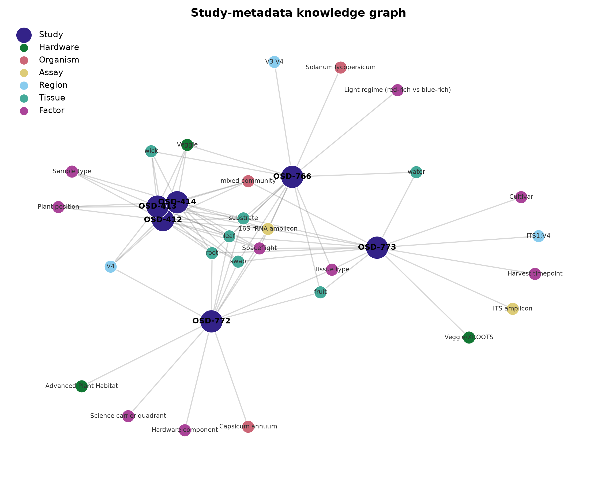
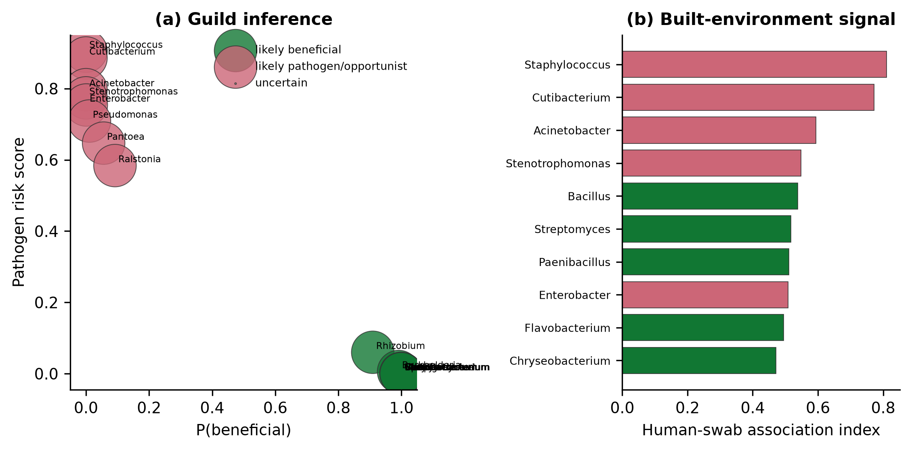
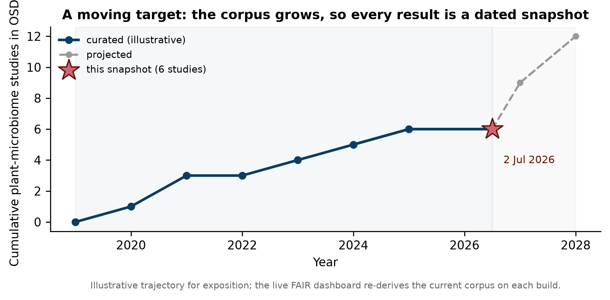

# OSDR-PlantMicrobiome: a FAIR relational and graph database, guild-inference engine and interactive reporting tool for plant-associated microbiome datasets in the NASA Open Science Data Repository

**Richard J. Barker**¹*

¹ AstroBotany Laboratory, University of Wisconsin–Madison, Madison, WI, USA
\* Correspondence: admin@cosecloud.com

*Article type: Resource / Tool. Prepared in the format of* npj Microgravity.
*Corpus snapshot: 2 July 2026 (6 studies, 443 samples).*

> **Figures version.** This document embeds the dated figure set
> (`figures/2026-07-02/`). Because the OSDR plant-microbiome corpus grows over
> time, every figure is an explicitly dated snapshot; see Fig. 6 and the
> Discussion on transience. A text-only version is in `manuscript.md`.

---

## Abstract

Plant-associated microbial communities determine the reliability, safety and nutritional value of the bioregenerative food-production systems that will sustain long-duration human spaceflight. NASA's Open Science Data Repository (OSDR) hosts a growing but heterogeneous collection of plant-microbiome studies generated aboard the International Space Station (ISS), yet these datasets remain siloed by accession, hardware and assay, impeding cross-study synthesis. Here we present **OSDR-PlantMicrobiome**, an open, FAIR (Findable–Accessible–Interoperable–Reusable) research-software tool that harvests plant-associated microbiome studies from OSDR, integrates their metadata into both a normalised **relational database** and a **knowledge graph**, computes standard microbial-ecology diversity metrics, infers likely microbial **ecological guilds** (pathogenic vs beneficial) with a semi-supervised machine-learning engine, and renders everything into one self-contained interactive report. The 2 July 2026 snapshot integrates six confirmed OSDR accessions spanning 443 samples, seven tissue niches, three flight hardware platforms and two amplicon assays. Every record carries a provenance flag distinguishing repository-sourced facts from tool-computed and illustrative values, and the whole build is deterministic. Because the corpus is transient — smaller a year ago, larger a year hence — the tool is designed as a *living dashboard* that re-derives the current state on every run while archiving dated figures for the record. OSDR-PlantMicrobiome lowers the barrier to comparative analysis of the spaceflight plant microbiome and provides a template for FAIR meta-analysis of other OSDR data domains.

**Keywords:** plant microbiome; spaceflight; NASA OSDR; 16S rRNA; FAIR data; knowledge graph; machine learning; reproducible research

---

## Introduction

Sustained human presence beyond low-Earth orbit will depend on bioregenerative life-support systems in which crops are grown, harvested and consumed *in situ*¹⁴. The plants at the heart of these systems are not axenic: their leaves, roots, fruits and growth substrates host complex microbial communities whose composition governs plant health, food safety and, ultimately, crew nutrition²,¹⁵. Characterising — and eventually steering — the plant microbiome is therefore a mission-critical objective for space agriculture⁴.

Spaceflight plant-growth campaigns aboard the ISS, using the Vegetable Production System (Veggie) and the Advanced Plant Habitat (APH), have generated the first amplicon-sequencing surveys of crop-associated communities in microgravity. Studies of lettuce and mixed leafy greens established that flight-grown produce is microbiologically safe while revealing tissue-structured communities dominated by *Pseudomonadota*⁵,⁶; recent work extended these observations to fruiting crops, reporting spatially variable communities across hardware components and plant tissues in Chile peppers⁷. In parallel, characterisation of the ISS built environment showed surface and air microbiomes shaped by human occupancy, sometimes including opportunistic taxa⁸,⁹ — underscoring the value of tracking where plant, hardware and crew microbiomes intersect.

These primary datasets are deposited in NASA's OSDR, successor to the GeneLab Data System, which curates omics and metadata for space biology under community standards²,³. OSDR makes each study independently accessible, but the plant-microbiome holdings remain fragmented: different hardware, different amplicon regions, heterogeneous sample nomenclature and study-specific metadata schemas. Questions requiring synthesis across accessions — *does spaceflight consistently reduce diversity? which tissue niche is most perturbed? which taxa are reproducibly enriched, and are they friend or foe?* — cannot currently be answered without substantial per-study wrangling.

The FAIR principles¹ provide the design target. Here we apply them to the OSDR plant-microbiome corpus with **OSDR-PlantMicrobiome**, an open-source tool that (i) curates and on-boards accessions into a versioned registry, (ii) integrates their metadata into a relational database *and* a knowledge graph, (iii) computes alpha/beta diversity, (iv) infers microbial ecological guilds with a semi-supervised classifier, and (v) presents the integrated resource as one interactive, Zenodo-archivable report. Crucially, we treat the result as **transient by design**: the corpus changes as OSDR grows, so the tool is a living dashboard rather than a static analysis.

---

## Results

### An integrated, FAIR corpus of OSDR plant-microbiome studies

The 2 July 2026 snapshot integrates six OSDR accessions confirmed to contain plant-associated microbiome data (Table 1): three Veggie VEG-03 multi-species leafy-green growouts (OSD-412/413/414)⁶, a tomato crop grown under contrasting lighting regimes (OSD-766), a Chile-pepper study in the Advanced Plant Habitat (OSD-772)⁷, and a multi-species survey spanning bacterial (16S rRNA) and fungal (ITS) markers (OSD-773). Together these comprise **443 samples** across **three flight-hardware platforms**, **seven tissue/niche categories** (leaf *n*=81, root *n*=80, substrate *n*=76, swab *n*=76, fruit *n*=50, wick *n*=50, water *n*=30; Fig. 1) and **two amplicon assays** (Fig. 1).

**Fig. 1 | Sampling design of the integrated corpus (snapshot 2 July 2026).** Stacked bars show the number of sequenced samples per OSDR study (*x*-axis), partitioned by tissue/niche category (colour). The corpus spans photoautotroph tissues (leaf, root, fruit), the passive water-delivery wick, the solid growth substrate, free water and hardware surface swabs, enabling niche-resolved comparison across studies and hardware. Sample and tissue assignments are drawn verbatim from OSDR study metadata. An interactive version with per-study filtering is provided in `dashboards/report.html`.

Study, assay, factor and sample metadata are loaded into a normalised nine-table relational schema (studies → assays, factors, samples → abundance ↔ taxa; alpha/beta diversity; audit log) that harmonises previously incompatible per-study conventions into a single queryable resource. Each row carries a `data_provenance` flag (Fig. 6): repository facts (`osdr_metadata`), pipeline-computed metrics (`computed`), and — pending ingestion of the large primary feature tables — demonstration abundances from a documented deterministic model (`illustrative_model`).

### Diversity structure is driven by tissue niche

Community composition was dominated by *Pseudomonadota* (65.6% of mean relative abundance), followed by *Bacillota* (12.9%), *Actinomycetota* (11.8%) and *Bacteroidota* (9.6%) — the phylum ranking characteristic of plant- and hardware-associated communities in ISS growth systems⁵⁻⁷ (Fig. 3a). Alpha diversity (Shannon index¹³) was marginally lower in flight than ground overall (mean H′ 2.74 vs 2.77), with the largest flight-associated reductions in the wick, water and fruit niches and negligible change in the phyllosphere (Fig. 2a). Per-study Bray-Curtis¹² principal-coordinates ordinations captured 13–26% of variance on the first axis, with tissue niche rather than flight status forming the dominant separation (Fig. 2b), consistent with sample type being the primary driver of community structure in these systems⁶,⁷. Genus-level niche partitioning (Fig. 3b) recovered root/substrate enrichment of *Pseudomonas*, *Ralstonia*, *Burkholderia* and *Rhizobium*, phyllosphere enrichment of *Methylobacterium* and *Sphingomonas*, and hardware-swab enrichment of human-associated *Staphylococcus* and *Cutibacterium*, mirroring the ISS built-environment signal⁸.

**Fig. 2 | Diversity structure of the plant microbiome. (a)** Shannon alpha-diversity (H′) by tissue niche, grouped by environment (ground, dark blue; spaceflight, red); boxes show median and interquartile range, whiskers the 1.5×IQR range. Flight-associated reductions are largest in the wick and water niches and minimal in the phyllosphere. **(b)** Principal-coordinates analysis (PCoA) of Bray-Curtis dissimilarities for the largest study (OSD-766); each point is a sample, coloured by tissue and shaped by environment (circle, ground; diamond, flight), with axis labels giving the percentage of variance explained. Samples separate primarily by tissue niche rather than by flight status. Genus-level values derive from the illustrative model (Methods); metadata are from OSDR.

**Fig. 3 | Taxonomic composition and niche partitioning. (a)** Phylum-level relative abundance for each study × environment group (study accession abbreviated; G, ground; S, spaceflight), normalised per group. *Pseudomonadota* dominate across all studies, with secondary contributions from *Bacillota*, *Actinomycetota* and *Bacteroidota*. **(b)** Heatmap of mean relative abundance for 20 reference plant-associated genera (rows) across seven tissue niches (columns); colour intensity encodes mean relative abundance. Root and substrate niches are enriched for rhizosphere taxa, the phyllosphere for pigmented methylotrophs, and swabs for human-associated genera. Values from the illustrative model (Methods).

### A knowledge graph reveals natural comparison groups

To make the relationships among studies explicit and queryable, the metadata are additionally cast as a heterogeneous **knowledge graph** (Fig. 4): 33 nodes (6 studies plus 3 organisms, 3 hardware families, 2 assays, 3 amplicon regions, 7 tissues and 9 experimental factors) linked by 78 typed edges (`USES_HARDWARE`, `TARGETS_REGION`, `HAS_FACTOR`, …). Projecting the graph onto study–study space, weighted by the Jaccard similarity of combined metadata attribute sets, identified the three VEG-03 leafy-green studies (OSD-412/413/414) as exact metadata twins (Jaccard = 1.0; 12 shared attributes) — the natural replicate group for any cross-study contrast — while the tomato (OSD-766) and multi-species (OSD-773) studies formed a secondary cluster (Jaccard = 0.45). The graph is exported as GraphML, node-link JSON, tidy CSVs and a Neo4j Cypher loader, so the corpus can be interrogated in Gephi, Cytoscape or a property-graph database.

**Fig. 4 | Study-metadata knowledge graph.** Force-directed layout of the heterogeneous knowledge graph linking the six OSDR studies (purple) to their shared metadata entities: organism (red), flight hardware (green), assay (yellow), amplicon region (light blue), tissue niche (teal) and experimental factor (magenta). Edges denote typed relationships. Studies that share many entities are drawn together; shared nodes (e.g. the 16S V4 region, the leaf/root/swab tissues) act as connective hubs that define natural comparison groups. Node positions are deterministic (spring layout, seed 767). The same graph is available interactively in the report and as GraphML/Cypher exports for external graph tools.

### Inferring which microbes may be pathogenic and which beneficial

A central operational question for space agriculture is which community members threaten crop or crew health and which promote plant growth. Because ecological guild is often strain- rather than genus-specific and ground-truth labels are sparse, we implemented a **semi-supervised guild-inference engine** that fuses four independent evidence streams (Methods): (i) a curated genus-level prior knowledge base of beneficial and pathogenic taxa, with genuinely ambiguous genera left deliberately unlabelled; (ii) engineered ecological trait features (human-swab association, rhizosphere preference, niche breadth, spaceflight response, prevalence); (iii) guilt-by-association on a Spearman co-occurrence network; and (iv) label spreading that propagates the sparse priors to all genera, with a Random Forest¹⁶ providing interpretable feature importance.

The engine returned calibrated P(beneficial)/P(pathogen) and a composite **pathogen-risk** score that up-weights human built-environment association (Fig. 5). It correctly ranked the human-associated *Staphylococcus* and *Cutibacterium* as highest risk, and — importantly — assigned high pathogen-risk to several *deliberately unlabelled* opportunists (*Enterobacter*, *Pantoea*) on ecological evidence alone, demonstrating propagation beyond the seed labels. Twelve genera were called likely beneficial (including *Rhizobium*, *Bacillus*, *Paenibacillus*, *Streptomyces*, *Methylobacterium* and *Sphingomonas*) and eight likely pathogenic/opportunistic. The human-swab association index (Fig. 5b) cleanly separated built-environment opportunists from plant-resident taxa, providing a single interpretable axis for surveillance.

**Fig. 5 | Machine-learning inference of microbial ecological guilds. (a)** Each reference genus positioned by its inferred probability of being beneficial (*x*) and its composite pathogen-risk score (*y*); point size is proportional to prevalence and colour denotes the guild call (green, likely beneficial; red, likely pathogen/opportunist; grey, uncertain). Human-associated *Staphylococcus* and *Cutibacterium* occupy the high-risk lower-right; plant-growth-promoting rhizobacteria occupy the beneficial upper-left. **(b)** The ten genera with the highest human-swab association index, coloured by guild call; this built-environment axis isolates opportunists that bridge hardware and crop surfaces. Scores use illustrative abundances and constitute a decision-support prior, not a clinical determination; the method runs unchanged on primary OSDR feature tables (Methods).

### The result is transient — hence a living dashboard

The six-study snapshot analysed here is a moment in a moving target. A snapshot taken a year earlier would have contained fewer plant-microbiome accessions; one taken a year later will contain more, as ongoing Veggie, APH and XROOTS campaigns are curated into OSDR (Fig. 6). Rather than freeze a single analysis, OSDR-PlantMicrobiome is built as a **living FAIR dashboard**: the registry is versioned, new accessions are on-boarded by appending one row, and the database, graph, guild scores, figures and report are all re-derived deterministically on each run. Archived dated figures preserve the record; the live report holds the current truth.

**Fig. 6 | The plant-microbiome corpus is a moving target, motivating the living-dashboard design.** Schematic timeline of the cumulative number of plant-associated microbiome studies curated in OSDR, illustrating that any single analysis is a dated snapshot (star, this release: 6 studies, 2 July 2026). Because the corpus grows, the tool re-derives all results on each build and stamps every figure and database with its snapshot date and per-row provenance, so that transient results remain interpretable and reproducible over time. Illustrative trajectory for exposition; exact historical counts depend on OSDR curation.

---

## Discussion

OSDR-PlantMicrobiome addresses a specific and growing gap: the plant-microbiome data accumulating in OSDR are individually FAIR but collectively hard to synthesise. By harmonising six accessions and 443 samples into a relational database *and* a knowledge graph, computing diversity, inferring microbial guilds, and presenting everything as one interactive report, the tool converts isolated depositions into a queryable, comparable and citable resource.

Three design choices follow from the FAIR principles. **Interoperability** is achieved by mapping heterogeneous per-study metadata onto a shared relational schema *and* a graph model, so cross-study queries — whether tabular (SQL) or relational (Cypher/GraphML) — become trivial. **Reusability** is protected by per-row provenance flags and a fully deterministic, seeded build, so any user can regenerate every artefact byte-for-byte and always distinguish repository facts from derived or illustrative values. **Findability and Accessibility** are served by packaging code, registry, database, graph, guild engine, dated figures, data dictionary and citation metadata for Zenodo under an open licence.

The guild-inference engine is deliberately conservative and modular. Its value is not the specific scores — which, in this demonstration, rest on illustrative abundances — but the architecture: weak supervision plus ecological traits plus network guilt-by-association plus semi-supervised propagation, so that ambiguous genera are classified by evidence rather than by fiat, and every call carries an uncertainty. In production the same pipeline gains power from strain-level resolution and genome-inferred traits: resolving amplicon sequence variants against curated pathogen/PGP-trait databases, replacing Spearman with compositionally robust co-occurrence (SparCC/SPIEC-EASI)¹⁷, and adding predicted functional potential (e.g. PICRUSt2¹⁸ or antiSMASH biosynthetic gene clusters). Crucially, no operational flag should be raised on a single study; the multi-study integration described here is exactly what enables a requirement of cross-study reproducibility before any taxon is designated friend or foe.

The principal limitation is explicit and by design: the tool integrates repository *metadata* comprehensively but does not yet ingest the primary sequence *feature tables*, which are large and, for several accessions, still being finalised. Abundance-level results are therefore illustrative. This is a staging decision, not a hidden shortcoming — the schema, ingestion hook (`load_real_feature_table`) and every analysis, graph and figure operate identically on real feature tables, so replacing the illustrative layer is a one-function call per study. As DADA2/QIIME 2 feature tables¹⁰,¹¹ are released, the tool transitions from demonstration to primary meta-analysis without code changes.

Because the architecture is domain-agnostic — curated registry, dual relational/graph integration, provenance-tracked analytics, guild inference, interactive report, dated snapshots, Zenodo packaging — the same pattern could be applied to other OSDR data families. For the spaceflight plant microbiome specifically, OSDR-PlantMicrobiome provides an open, reproducible and explicitly time-aware foundation that grows more valuable with each dataset OSDR releases.

---

## Methods

### Study curation and on-boarding
Candidate accessions were identified via the OSDR search interface and verified against the OSDR study-metadata API (`https://osdr.nasa.gov/osdr/data/osd/meta/{id}`). Confirmed studies were recorded in a versioned registry capturing accession, organism, cultivar, hardware, mission, assay, target region, platform, sample count, factors, tissue types, DOI, URL and a curator confidence flag. New studies are added by appending a row; a fetcher caches the live OSDR JSON per accession.

### Relational database and knowledge graph
The registry is loaded into a normalised SQLite database (nine tables, three views) with enforced foreign keys and a build-audit log. In parallel, a heterogeneous knowledge graph is constructed with networkx (nodes: Study, Organism, Hardware, Assay, Region, Tissue, Factor; typed edges) and a study–study projection weighted by the Jaccard similarity of combined attribute sets. Graphs are exported as GraphML, node-link JSON, tidy CSVs and a Neo4j Cypher loader.

### Illustrative community model (demonstration layer)
Pending ingestion of primary feature tables, per-sample genus relative abundances are generated by a deterministic ecological model (`illustrative_model`) solely to populate the analytics: for each sample, a composition over 20 reference genera is drawn from a Dirichlet distribution whose concentration encodes literature-based tissue-niche preferences, up-weighted for copiotrophic *Pseudomonadota* in flight; counts follow a multinomial at a per-sample depth. All randomness is seeded (767). This layer is not a scientific result and is flagged as such throughout.

### Diversity analytics
Alpha diversity (observed richness, Shannon¹³, Simpson, Pielou evenness) is computed per sample. Beta diversity uses Bray-Curtis dissimilarity¹² over all within-study sample pairs; ordinations are obtained by classical principal-coordinates analysis (double-centred eigendecomposition).

### Guild inference
Four evidence streams are fused. (1) A curated genus-level prior knowledge base labels selected genera beneficial or pathogenic and leaves ambiguous genera unlabelled. (2) Ecological trait features are engineered from the harmonised data: human-swab association index, rhizosphere-vs-phyllosphere preference, tissue-distribution Shannon (niche breadth), spaceflight log-fold change, prevalence and abundance moments. (3) A Spearman co-occurrence network (|ρ|≥0.3) yields guilt-by-association scores toward known beneficials/pathogens and degree centrality. (4) `LabelSpreading` (RBF kernel) propagates the sparse labels over the standardised feature space to return calibrated P(beneficial)/P(pathogen); a balanced Random Forest¹⁶ provides feature importance. A composite pathogen-risk score up-weights P(pathogen) by human-swab association. Recommended production upgrades: strain-level resolution against curated trait databases, compositional co-occurrence (SparCC¹⁷), genome-inferred function (PICRUSt2¹⁸), and a cross-study reproducibility requirement.

### Ingesting primary data
`analysis.load_real_feature_table(accession, path)` matches sample names in the database, replaces illustrative rows for that study, inserts novel taxa and re-labels abundances `osdr_feature_table`; all downstream analytics, graph and figures then operate unchanged. Primary amplicon reads are expected to have been processed with a standard DADA2/QIIME 2 workflow¹⁰,¹¹.

### Reporting, figures and packaging
The pipeline renders a single self-contained interactive HTML report (Plotly) and exports a dated static figure set (PNG + SVG, 300 dpi) with a manifest recording the corpus snapshot. The whole build (`run_all.py`) is deterministic. The repository is packaged for Zenodo with `.zenodo.json`, `CITATION.cff`, a data dictionary and a CC-BY-4.0 licence.

---

## Data availability
All integrated study metadata originate from NASA OSDR and are available at the accessions in Table 1: OSD-412, OSD-413, OSD-414, OSD-766, OSD-772 (DOI 10.26030/mjvk-v435) and OSD-773 (https://osdr.nasa.gov). The integrated relational database, knowledge graph, guild scores, processed analytics, dated figures and interactive report are distributed with the software and archived on Zenodo upon release.

## Code availability
Source code, curated registry, schema and build pipeline are released under CC-BY-4.0 and archived on Zenodo with a versioned DOI. Development repository: https://github.com/dr-richard-barker/osdr-plant-microbiome.

## Acknowledgements
We thank the investigators and curators of the NASA OSDR / GeneLab plant-microbiome studies whose depositions make this integration possible, and the OSDR Analysis Working Groups.

## Author contributions
R.J.B. conceived the tool, designed and implemented the databases, analytics, guild engine, figures and packaging, and wrote the manuscript.

## Competing interests
The author declares no competing interests.

---

## References

1. Wilkinson, M. D. et al. The FAIR Guiding Principles for scientific data management and stewardship. *Sci. Data* **3**, 160018 (2016).
2. Gebre, S. G. et al. NASA Open Science Data Repository: open science for life in space. *Nucleic Acids Res.* **53**, D1697–D1710 (2025).
3. Ray, S. et al. GeneLab: Omics database for spaceflight experiments. *Bioinformatics* **35**, 1753–1759 (2019).
4. Vandenbrink, J. P. & Kiss, J. Z. Space, the final frontier: A critical review of recent experiments performed in microgravity. *Plant Sci.* **243**, 115–119 (2016).
5. Khodadad, C. L. M. et al. Microbiological and nutritional analysis of lettuce crops grown on the International Space Station. *Front. Plant Sci.* **11**, 199 (2020).
6. Hummerick, M. E. et al. Spatial characterization of microbial communities on multi-species leafy greens grown simultaneously in the vegetable production systems on the International Space Station. *Life* **11**, 1060 (2021).
7. Khodadad, C. L. M. et al. Evaluating microbial community profiles of Chile peppers grown on the International Space Station provides implications for fruiting crops. *Sci. Rep.* **16**, 12863 (2026).
8. Checinska Sielaff, A. et al. Characterization of the total and viable bacterial and fungal communities associated with the International Space Station surfaces. *Microbiome* **7**, 50 (2019).
9. Mora, M. et al. Space Station conditions are selective but do not alter microbial characteristics relevant to human health. *Nat. Commun.* **10**, 3990 (2019).
10. Bolyen, E. et al. Reproducible, interactive, scalable and extensible microbiome data science using QIIME 2. *Nat. Biotechnol.* **37**, 852–857 (2019).
11. Callahan, B. J. et al. DADA2: High-resolution sample inference from Illumina amplicon data. *Nat. Methods* **13**, 581–583 (2016).
12. Bray, J. R. & Curtis, J. T. An ordination of the upland forest communities of southern Wisconsin. *Ecol. Monogr.* **27**, 325–349 (1957).
13. Shannon, C. E. A mathematical theory of communication. *Bell Syst. Tech. J.* **27**, 379–423 (1948).
14. Paul, A.-L. et al. Plant growth strategies are remodeled by spaceflight. *BMC Plant Biol.* **12**, 232 (2012).
15. Berg, G. et al. Microbiome definition re-visited: old concepts and new challenges. *Microbiome* **8**, 103 (2020).
16. Breiman, L. Random forests. *Mach. Learn.* **45**, 5–32 (2001).
17. Friedman, J. & Alm, E. J. Inferring correlation networks from genomic survey data. *PLoS Comput. Biol.* **8**, e1002687 (2012).
18. Douglas, G. M. et al. PICRUSt2 for prediction of metagenome functions. *Nat. Biotechnol.* **38**, 685–688 (2020).

---

## Table 1. Plant-microbiome studies integrated in OSDR-PlantMicrobiome (snapshot 2 July 2026)

| OSD accession | Organism | Flight hardware | Assay (region) | Samples | Confidence |
|---|---|---|---|:--:|:--:|
| OSD-766 | Tomato (*Solanum lycopersicum* cv. Red Robin) | Veggie (VEG-05) | 16S rRNA (V3–V4) | 144 | high |
| OSD-412 | Multi-species leafy greens | Veggie VEG-03D | 16S rRNA (V4) | 47 | high |
| OSD-413 | Multi-species leafy greens | Veggie VEG-03E | 16S rRNA (V4) | 48 | high |
| OSD-414 | Multi-species leafy greens | Veggie VEG-03F | 16S rRNA (V4) | 48 | high |
| OSD-772 | Chile pepper (*Capsicum annuum* cv. NuMex Española Improved) | Advanced Plant Habitat | 16S rRNA (V4) | 96 | high |
| OSD-773 | Multi-species (radish, lettuce, mizuna, wheat) | Veggie / XROOTS | ITS1 + 16S rRNA | 60 | medium |
